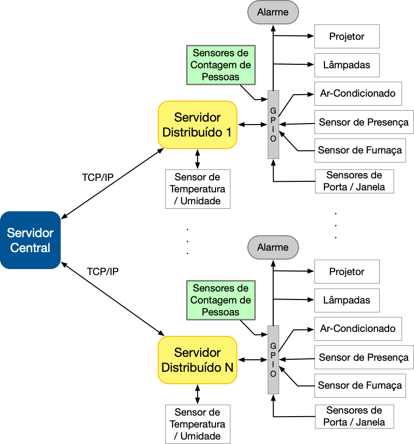
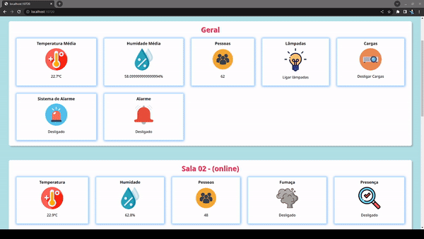

# Tabalho 1 - Fundamentos de Sistemas Embarcados 2022/2 - Automacão Predial

|Matrícula | Aluno |
| :--: | :--: |
| 190020377 |  Thiago Paiva |

<hr>

## 1. Objetivos

Este trabalho tem por objetivo a criação de um sistema distribuído de automação predial para monitoramento e acionamento de sensores e dispositivos de um prédio com múltiplas salas. O sistema deve ser desenvolvido para funcionar em um conjunto de placas Raspberry Pi com um servidor central responsável pelo controle e interface com o usuário e servidores distribuídos para leitura e acionamento dos dispositivos. Dentre os dispositivos envolvidos estão o monitoramento de temperatura e umidade, sensores de presença, sensores de fumaça, sensores de contagem de pessoas, sensores de abertura e fechamento de portas e janelas, acionamento de lâmpadas, aparelhos de ar-condicionado, alarme e aspersores de água em caso de incêndio.



<hr>

## 2. Interface



## 3. Uso

### Central
```bash
# Inicia o servidor central na porta 17011 e o servidor web na porta 17020

$ make run-central
```

### Distribuido
```bash
# Acesso e tunelamento
$ ssh ssh -R 10711:127.0.0.1:10711 <usuario>@<ip_sala> -p 13508

# Na pasta raiz do projeto instale as dependencias
$ make install


# Inicie o distribuido passado o seu arquivo de configuracao
$ make run-distributed DISTRIBUTED_CONFIG_JSON_FILE=<configuracao_sala_x.json>

```

## 4. Apresentação

### Funcionamento

### Código

